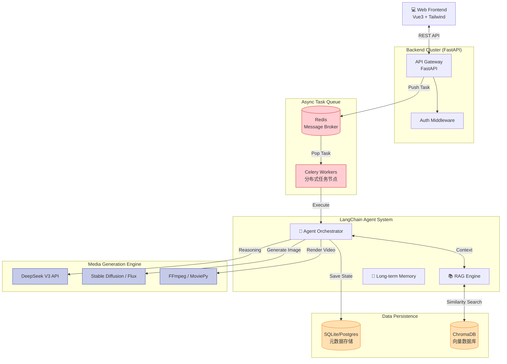

# Auto-Media-Agent (全自动 AI 媒体矩阵系统)

这是一个基于 Agent 的全自动 AI 媒体内容生产系统。它能够自动抓取新闻、进行 AI 深度调研、生成多风格文案，并最终合成短视频进行全平台分发。

## 🏗 System Architecture (系统架构)

### 1. 业务流程图 (Business Flow)

```mermaid
graph LR
    %% 定义样式
    classDef input fill:#e1f5fe,stroke:#01579b,stroke-width:2px;
    classDef process fill:#fff9c4,stroke:#fbc02d,stroke-width:2px;
    classDef output fill:#e8f5e9,stroke:#2e7d32,stroke-width:2px;

    %% 节点定义
    User((用户/定时任务))
    subgraph Input [数据输入层]
        RSS[RSS 订阅源]
        Search[Google/Serper 搜索]
    end

    subgraph Brain [AI 处理核心]
        Researcher[🕵️ 调研 Agent]
        Writer[✍️ 编辑 Agent]
        Director[🎬 导演 Agent]
    end

    subgraph Media [多模态生成工厂]
        ImgGen[🎨 Flux/SD 绘图]
        VidGen[🎥 FFmpeg 视频合成]
        TTS[🔊 Edge-TTS 配音]
    end

    subgraph Channel [分发渠道]
        WeChat[📱 微信推送]
        Web[🌐 Web 前端展示]
        Social[🔥 小红书/推特]
    end

    %% 连线关系
    User -->|触发| Input
    Input -->|原始信息| Researcher
    Researcher -->|清洗后数据| Writer
    Writer -->|文案脚本| Director
    Director -->|绘画提示词| ImgGen
    Director -->|字幕与配音| TTS
    ImgGen & TTS -->|素材| VidGen
    VidGen -->|成品视频| Channel
    Writer -->|图文内容| Channel

    %% 应用样式
    class RSS,Search input;
    class Researcher,Writer,Director process;
    class WeChat,Web,Social output;
```

### 2. 技术架构图 (Tech Stack)

